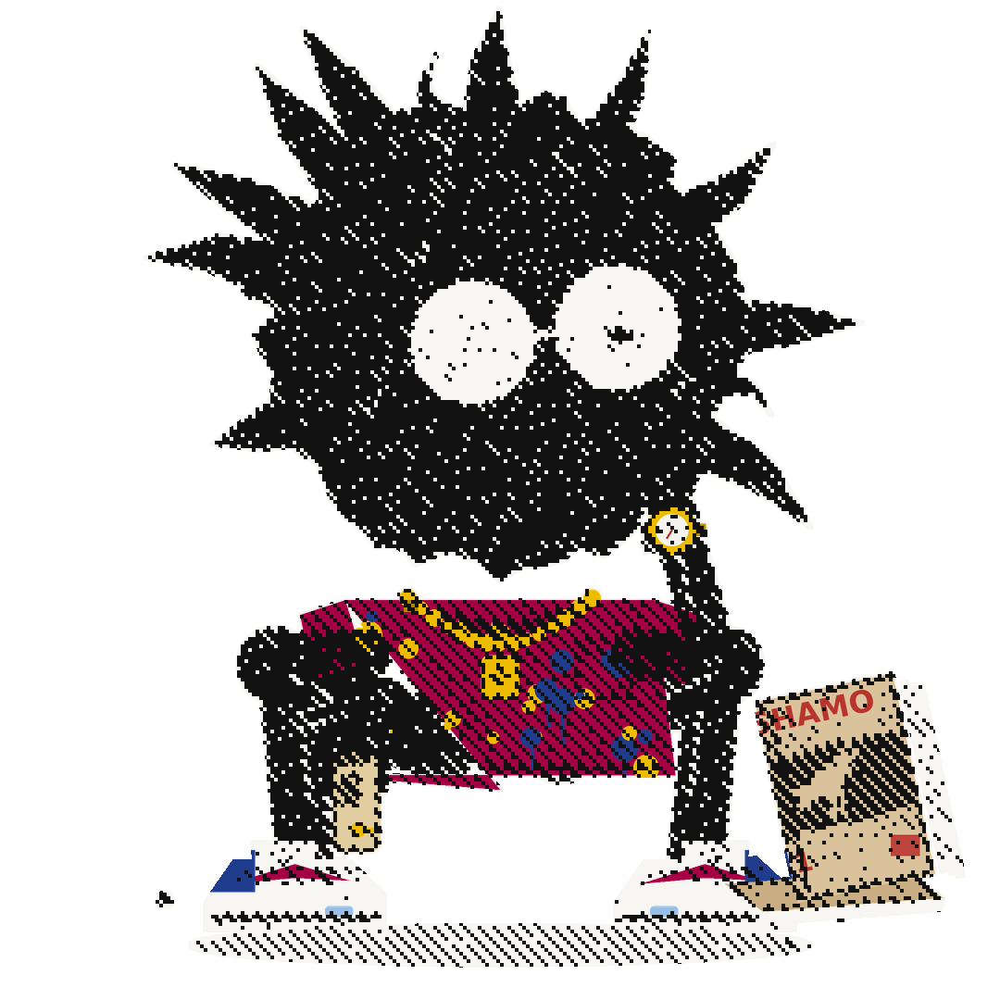
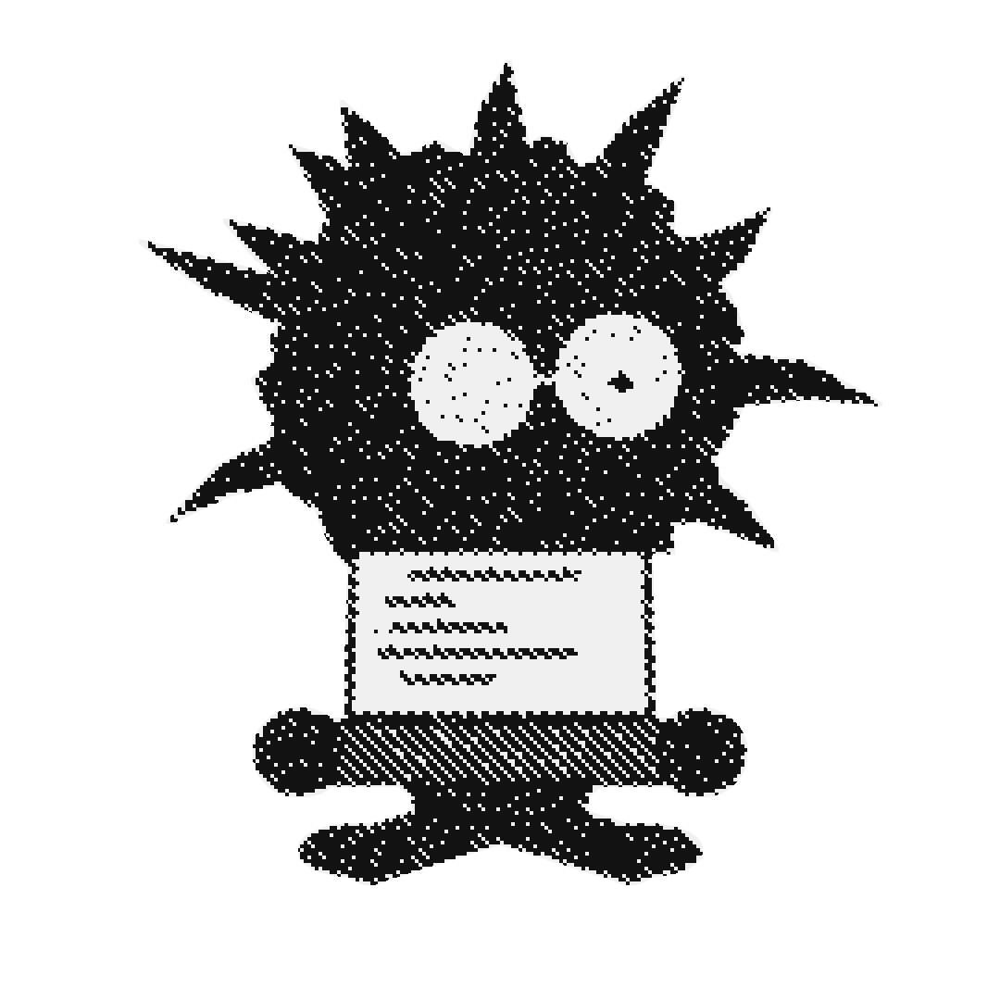
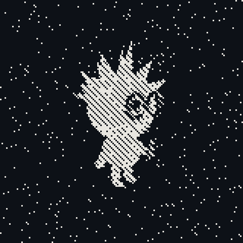

<picture>
  <source media="(prefers-color-scheme: dark)" srcset="assets/hero_dark.png">
  
</picture>

<h1>Phyes</h1>

<h3><code>bots, agents &amp; self-hosted things</code></h3>

<code>🇫🇷 Paris</code> · <a href="mailto:phyespro@gmail.com"><code>phyespro@gmail.com</code></a>

<ul>
  <li>🤖 Discord bots running in prod — <a href="https://github.com/PhyesGG/AGC-BOT"><b>AGC-BOT</b></a> (Twitch alerts) &amp; <a href="https://github.com/PhyesGG/LKL-BOT"><b>LKL-BOT</b></a> (tickets)</li>
  <li>🎵 <a href="https://github.com/PhyesGG/BeatsClash"><b>BeatsClash</b></a> — music battles between friends, who really has the best taste?</li>
  <li>❄️ <a href="https://github.com/PhyesGG/NixConfig"><b>NixConfig</b></a> — my machines are declarative, my sleep schedule isn't</li>
  <li>🛠️ chronic <a href="https://github.com/codecrafters-io/build-your-own-x"><i>build-your-own-x</i></a> enjoyer — why install it when you can rebuild it?</li>
  <li>📖 always one volume of <i>Shamo</i> within reach</li>
  <li>🧪 currently: running an org of <b>13 AI agents</b> in my homelab — 3 departments, a lead agent per department — reports land on my desk <code>(¬‿¬)</code></li>
</ul>

<blockquote>Most of the interesting stuff runs self-hosted, so the graphs below only tell half the story.</blockquote>

 

  

  

<picture>
  <source media="(prefers-color-scheme: dark)" srcset="assets/dev_dark.png">
  
</picture>

<h3><code>$ stack --most-used</code></h3>

TypeScript &amp; JavaScript for the bots, Python for the agents, 
Nix for the machines — and whatever it takes for the rest.

 

  
   
  hand-built 3D, halftone-dithered frame by frame — same trame as everything else here

 

  character &amp; artwork: original 1-bit dither work — <b>Phyes</b>

